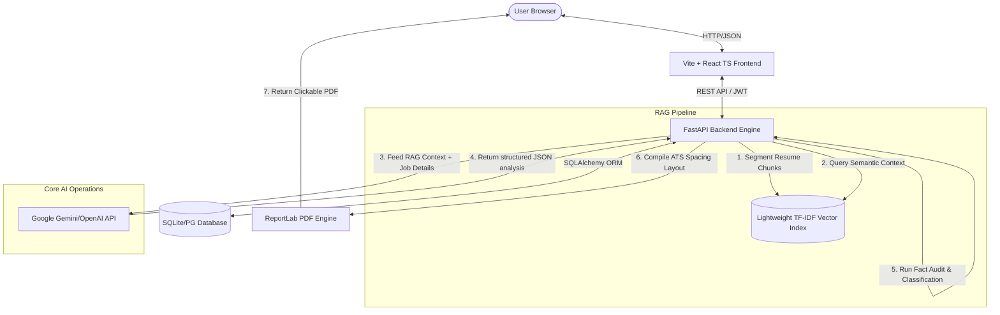
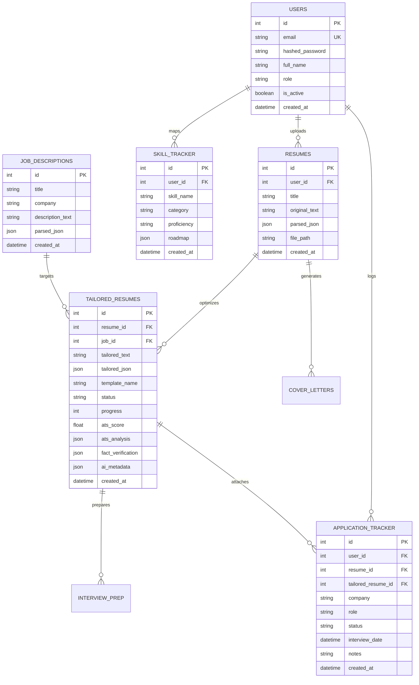

# ResumeForge AI - Production-Ready ATS Optimizer & Career Coach

ResumeForge AI is an enterprise-grade SaaS web application that helps users optimize their resumes for Applicant Tracking Systems (ATS) with absolute truthfulness. It features a semantic **RAG (Retrieval-Augmented Generation) Pipeline** for content filtering, an **AI Fact Verification Auditor** to block hallucinated skills, an interactive **Resume Diff Viewer**, a kanban **Job Tracker**, and an automated **Interview Simulator / Career Coach**.

---

## 🏗️ System Architecture



---

## 📊 Database Schema (Entity-Relationship)



---

## 🔌 API Documentation

All routes prefix with `/api/v1`. Visit `http://localhost:8000/docs` on startup for interactive Swagger UI docs.

### 🔑 Authentication (`/auth`)
| Method | Endpoint | Payload | Description |
| :--- | :--- | :--- | :--- |
| `POST` | `/auth/register` | `UserCreate` (email, password, full_name) | Signs up a new account. |
| `POST` | `/auth/login` | `UserLogin` (email, password) | Returns JWT Bearer token. |
| `GET` | `/auth/me` | *Bearer Token* | Returns active profile parameters. |

### 📄 Resumes (`/resumes`)
| Method | Endpoint | Payload | Description |
| :--- | :--- | :--- | :--- |
| `POST` | `/resumes/upload` | Form-Data (title, file) | Uploads PDF/DOCX resume and parses contents. |
| `GET` | `/resumes/` | *Bearer Token* | Lists all uploaded profiles. |
| `DELETE` | `/resumes/{id}` | *Bearer Token* | Deletes master resume. |

### 🛠️ Optimization (`/tailor`)
| Method | Endpoint | Payload | Description |
| :--- | :--- | :--- | :--- |
| `POST` | `/tailor/` | `TailorRequest` (resume_id, job_description_text) | Spawns async background tailoring pipeline. |
| `GET` | `/tailor/{id}/status` | *Bearer Token* | Polls status and completion progress (0-100%). |
| `GET` | `/tailor/{id}` | *Bearer Token* | Fetches tailored resume, modifications diff, and fact-checking report. |
| `GET` | `/tailor/{id}/download-pdf` | *Query params* (`template=professional`) | Compiles and downloads clickable, parser-friendly PDF. |

### 📅 Funnel Tracker (`/applications`)
| Method | Endpoint | Payload | Description |
| :--- | :--- | :--- | :--- |
| `POST` | `/applications/` | `ApplicationCreate` (company, role, status) | Adds card to Kanban board. |
| `PUT` | `/applications/{id}` | `ApplicationUpdate` (status, notes, interview_date) | Updates stage columns or calendar events. |
| `GET` | `/applications/` | *Bearer Token* | Lists user's tracking entries. |

---

## 🛠️ Local Installation

### Backend Setup
1. Navigate to the backend folder:
   ```bash
   cd backend
   ```
2. Create and activate a Python virtual environment:
   ```bash
   python -m venv venv
   # On Windows
   .\venv\Scripts\activate
   ```
3. Install dependencies:
   ```bash
   pip install -r requirements.txt
   ```
4. Create a `.env` file in the `backend/` directory:
   ```env
   DATABASE_URL=sqlite:///./resumeforge.db
   SECRET_KEY=yoursecretjwtkeyhere
   GEMINI_API_KEY=your_gemini_api_key_here
   DEMO_MODE=false
   ```
   *(If keys are omitted, the backend auto-enables **Demo Mode** to serve high-fidelity simulated content)*
5. Run the FastAPI development server:
   ```bash
   uvicorn app.main:app --reload
   ```

### Frontend Setup
1. Navigate to the frontend folder:
   ```bash
   cd frontend
   ```
2. Install npm packages:
   ```bash
   npm install
   ```
3. Run the Vite development web app:
   ```bash
   npm run dev
   ```
4. Open your browser to `http://localhost:5173`. Log in using `demo@resumeforge.ai` / `password123` to test with pre-seeded dashboards.

---

## 🐳 Docker Deployment

To launch the entire postgres-backed microservice stack instantly:
```bash
# Start all containers in the background
docker-compose up -d --build
```
This maps:
- Frontend Client: `http://localhost:5173`
- Backend API Docs: `http://localhost:8000/docs`

---

## 🚀 Cloud Hosting Guides

### 💾 Database Setup (Supabase)
1. Provision a free PostgreSQL database on [Supabase](https://supabase.com).
2. Grab the Database connection string from **Database Settings > Connection string > URI** (Transaction Pooler).
3. Insert this connection URI as your `DATABASE_URL` environment variable inside your Render dashboard settings.

### ⚙️ Backend Deployment (Render)
1. Connect your GitHub repository to [Render](https://render.com).
2. Create a new **Web Service**, choosing **Python** environment.
3. Configure settings:
   - **Build Command**: `pip install -r backend/requirements.txt`
   - **Start Command**: `python -m uvicorn app.main:app --host 0.0.0.0 --port $PORT` (Inside backend directory)
4. Bind Environment Variables: `DATABASE_URL`, `SECRET_KEY`, `GEMINI_API_KEY`, `DEMO_MODE` = `false`.

### 🖥️ Frontend Host (Vercel)
1. Deploy a new static application on [Vercel](https://vercel.com).
2. Set root directory to `frontend/`.
3. Add Build Commands:
   - **Framework Preset**: Vite
   - **Build Command**: `npm run build`
   - **Install Command**: `npm install`
4. Set Frontend API variables:
   - Make sure frontend fetch calls target your Render Web Service URL.
